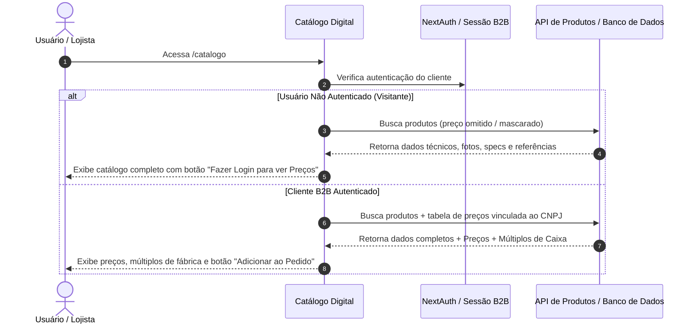
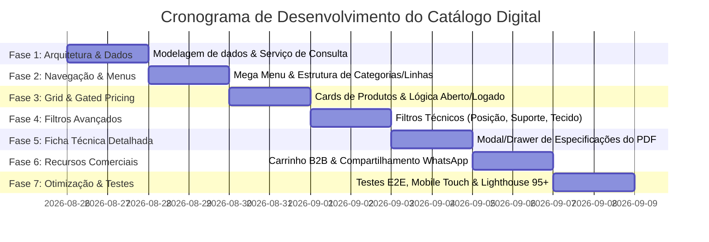

# Plano de Implementação: Catálogo Digital RF Representações (Altenburg)

> **Documento de Especificação e Planejamento Estratégico**  
> **Versão:** 1.0  
> **Data:** Agosto / 2026  
> **Base de Produtos:** +5.200 SKUs sincronizados com especificações técnicas completas

---

## 1. Visão Geral e Objetivos do Produto

O **Catálogo Digital da RF Representações** foi concebido para ser uma plataforma moderna, fluida e de alta conversão para representantes comerciais e lojistas parceiros. Ele substitui os tradicionais catálogos estáticos em PDF por uma experiência interativa, ultra rápida no mobile e desktop, integrando toda a riqueza técnica e comercial dos produtos da **Altenburg**.

### 🎯 Principais Diferenciais
1. **Hierarquia e Navegação por Menus & Subdivisões**: Reproduz a experiência intuitiva do portal oficial da Altenburg com Mega Menu e subdivisões por categoria e linhas comerciais (Luxo, Especiais, Essenciais, Básicos).
2. **Duplo Modo de Visualização (*Gated Pricing*)**:
   - **Catálogo Aberto / Visitante**: Acesso livre à galeria de fotos em alta resolução, fichas técnicas, descrições e referências de fábrica. Os preços ficam protegidos com aviso *"Faça login para consultar preços e condições comerciais"*.
   - **Cliente B2B Autenticado**: Acesso imediato à tabela de preços, múltiplos de venda de fábrica (ex: Caixa com 02 un, Saco Master com 06 un), montagem de pedidos/cotações e envio instantâneo para o representante via WhatsApp.
3. **Filtros Técnicos Específicos (Superior ao PDF)**: Filtros em tempo real por *Posição de Dormir*, *Tecnologia do Enchimento*, *Composição do Tecido*, *Dimensões*, *Suporte* e *Propriedades Antimicrobianas/Térmicas*.
4. **Performance para +5.000 Itens**: Renderização instantânea, paginação/virtualização para mobile e busca tolerante por código de referência, EAN ou nome da linha.

---

## 2. Estrutura de Navegação & Taxonomia (Mega Menu e Categorias)

A taxonomia do catálogo espelha a divisão do e-commerce oficial da Altenburg somada à categorização de linhas do catálogo de fábrica:

```mermaid
graph TD
    Root["Catálogo RF Representações"]
    
    Root --> CamaCasal["Cama Casal"]
    Root --> CamaQueen["Cama Queen"]
    Root --> CamaKing["Cama King"]
    Root --> CamaSolteiro["Cama Solteiro"]
    Root --> Travesseiros["Travesseiros"]
    Root --> Protecao["Protetores & Acessórios"]
    Root --> Banho["Banho"]
    Root --> Infantil["Infantil"]
    Root --> Promocoes["Lançamentos & Outlet"]

    Travesseiros --> TLuxo["Linha Luxo (Faixas 6 e 7)"]
    Travesseiros --> TEspeciais["Linha Especiais (Faixas 4 e 5)"]
    Travesseiros --> TEssenciais["Linha Essenciais (Faixas 2 e 3)"]
    Travesseiros --> TBasicos["Linha Básicos (Faixa 1)"]
    Travesseiros --> TFronhas["Fronhas & Porta-Travesseiro"]

    Protecao --> PColchao["Protetor de Colchão Impermeável"]
    Protecao --> PTravesseiro["Protetor de Travesseiro"]
    Protecao --> PPillow["Pillow Tops (Iceflow, Plumi, Lit Blanc)"]
    Protecao --> PSaia["Saia Box (Easy Fit, Franzida, etc.)"]
    Protecao --> PDuvet["Enchimento de Duvet"]

    Banho --> TBanho["Toalha de Banho"]
    Banho --> TRosto["Toalha de Rosto"]
    Banho --> TJogo["Jogos de Banho"]
    Banho --> TPiso["Piso / Tapetes"]
```



### Subdivisão Detalhada das Linhas de Travesseiros (Baseado no Catálogo Técnico)

| Linha | Conceito / Posicionamento | Exemplos de Famílias e Modelos |
| :--- | :--- | :--- |
| **Linha Luxo** | Máxima tecnologia, personalização e acabamento sofisticado (Faixas 06 e 07). | `Signature`, `Twins`, `Black`, `Jacquard`, `Gran Suite`, `Gellou`, `Glacier Alto/Médio`, `Bambu (Comfort Látex / Visco / Fibra)`, `Visco Alto/Médio`, `Visco Cervical`, `Cetim 250 Fios`. |
| **Linha Especiais** | Tecnologias exclusivas para necessidades específicas (Faixas 04 e 05). | `Blöcke (Massageador)`, `Puffer`, `Dermaline (Íons de Cobre)`, `Levitare (Plus, King, Multiuso)`, `Gelatto & Gelatto Nasa`, `Body Pillow Gelatto`, `Nasasoft`, `Ultracomfort (Tencel)`, `Plumi Gold`. |
| **Linha Essenciais** | Ampla opção de enchimentos e ótimo custo-benefício (Faixas 02 e 03). | `Piemonte`, `Florest (Sustentável/PET)`, `Antistress & Antistress 360°`, `Body Pillow & Super Body Pillow`, `Dueto Toque de Seda`, `Fresh Ice`, `Sono e Saúde (Adulto, Júnior, Baby)`, `Visco Nasa`, `Que Pluma!`, `Liberty`, `Suporte Médio / Firme / Extra Firme`. |
| **Linha Básicos** | Conforto essencial para o dia a dia e alto volume (Faixa 01). | `Soft Touch`, `Silk Touch`, `Toque de Pétala`, `Toque Aveludado`, `Multiuso`, `Baby`, `Almofadas & Rolinhos`, `Refis de Enchimento (500g)`. |

---

## 3. Matriz de Filtros Técnicos Interativos

Para transformar a experiência de compra em algo muito mais prático e consultivo do que folhear 134 páginas de PDF, a interface contará com filtros multifacetados combináveis:

```
┌─────────────────────────────────────────────────────────────────────────────┐
│ 🔍 Buscar por Nome, Referência (ex: 01674845999001) ou EAN...               │
├─────────────────────────────────────────────────────────────────────────────┤
│ Pílulas de Coleção: [Todas] [Dermaline] [Levitare] [Gelados] [Bambu] [Antistress] [Florest]
├─────────────────────────────────────────────────────────────────────────────┤
│ FILTROS TÉCNICOS:                                                           │
│ ├─ Posição de Dormir: [ ] Lado   [ ] Costas   [ ] Bruços   [ ] Todas        │
│ ├─ Nível de Suporte:  [ ] Macio  [ ] Médio    [ ] Firme    [ ] Extra Firme  │
│ ├─ Enchimento:        [ ] Levitare® (Plumas)  [ ] Viscoelástico / Gel       │
│                       [ ] Sensação Látex      [ ] Plumi® / Soft Fill®       │
│ ├─ Tecido / Capa:     [ ] Percal 200/233 fios [ ] 100% Algodão              │
│                       [ ] Íons de Cobre       [ ] Viscose de Bambu          │
│                       [ ] Fio de Carbono      [ ] Poliamida Gelada          │
│ ├─ Tamanho:           [ ] 50x70cm [ ] 50x90cm (King) [ ] Body Pillow        │
│ └─ Diferenciais:      [ ] Lavável em Máquina  [ ] Capa com Zíper            │
│                       [ ] Antimicrobiano      [ ] Impermeável               │
└─────────────────────────────────────────────────────────────────────────────┘
```

---

## 4. Estratégia de Duplo Acesso: Visitante vs. Cliente Logado (*Gated Pricing*)



### Comparativo Visual do Card de Produto

```
┌──────────────────────────────────────┐     ┌──────────────────────────────────────┐
│       MODO VISITANTE (PÚBLICO)       │     │        MODO CLIENTE LOGADO           │
├──────────────────────────────────────┤     ├──────────────────────────────────────┤
│  [ FOTO DO PRODUTO EM ALTA DEFINIÇÃO ]│     │  [ FOTO DO PRODUTO EM ALTA DEFINIÇÃO ]│
│                                      │     │                                      │
│  Travesseiro Levitare Plus           │     │  Travesseiro Levitare Plus           │
│  Ref: 01681601999001                 │     │  Ref: 01681601999001                 │
│  🏷️ Suporte Firme • Percal 200 fios   │     │  🏷️ Suporte Firme • Percal 200 fios   │
│                                      │     │                                      │
│  🔒 Preço sob consulta               │     │  💰 R$ 89,90 / un                    │
│  [ Fazer Login para Ver Preços ]     │     │  📦 Múltiplo: Caixa c/ 06 unidades   │
│  [ Ver Ficha Técnica ]               │     │  [ - 1 + ] [ Adicionar ao Pedido ]   │
└──────────────────────────────────────┘     └──────────────────────────────────────┘
```

---

## 5. UI/UX Mobile-First: Elementos de Interface

Como a maioria dos representantes e lojistas utiliza o smartphone em loja ou visitas presenciais:

1. **Header Compacto com Busca Inteligente**:
   - Barra de busca fixa com histórico e sugestões em tempo real.
   - Menu Hambúrguer lateral com categorias e linhas acompanhadas de contadores numéricos de itens.
   - Botão de Acesso Rápido ao Pedido / Cotação (Badge de contagem flutuante).
2. **Carrossel de Imagens Fluidos nos Cards e Detalhes**:
   - Suporte a gestos touch nativos (swipe horizontal).
   - Visualização de detalhes com zoom de alta resolução.
3. **Ficha Técnica Inspirada no PDF em Modal / Drawer**:
   - **Cabeçalho**: Nome do produto, linha (ex: `Linha Luxo`), referência de fábrica (copiável com 1 clique).
   - **Tags de Ícones Técnicos**:
     - *Posição de dormir* (ícones ilustrados).
     - *Capa lavável em máquina*.
     - *Ação antimicrobiana / Não alérgico*.
     - *Capa com zíper*.
     - *Embalagem de fábrica* (Saco Master / Caixa / PVC com botão).
   - **Tabela de Medidas e Gramaturas**:
     - Comprimento, Largura, Altura, Peso do Enchimento (ex: `100% poliéster - 1200g`).
   - **Ação Rápida WhatsApp**:
     - Botão *"Compartilhar no WhatsApp"* que gera uma mensagem formatada com foto, especificações e dados do produto para envio ao lojista.

---

## 6. Arquitetura Técnica e Engenharia de Dados

### 6.1 Modelo de Dados no Catálogo

A fonte de dados consolidada em `data/altenburg-products.json` contém **5.282 registros**. O schema de tipos e APIs é estruturado para suportar:

```typescript
export interface ProductItem {
  id: string;                      // ID único do SKU
  referencia: string | null;       // Código de referência de fábrica (ex: 01674845999001)
  ean: string | null;              // Código de barras EAN-13
  nome: string;                    // Nome completo do produto
  descricao: string;               // Descrição comercial detalhada
  marca: string;                   // "Altenburg"
  categorias: string[];            // ["Travesseiro/Luxo", "Travesseiro"]
  preco: number | null;            // Preço unitário tabela
  foto: string | null;             // Imagem principal
  fotos: string[];                 // Galeria de imagens
  especificacoes: {                // Ficha técnica
    posicaoDormir?: string | string[];
    suporte?: string;
    tecido?: string | string[];
    composicao?: string;
    enchimento?: string;
    tamanho?: string;
    largura?: string;
    comprimento?: string;
    altura?: string;
    instrucaoLavagem?: string;
    multiploVenda?: string;
    embalagem?: string;
    [key: string]: unknown;
  };
}
```

### 6.2 Estratégia de Performance para +5.000 Produtos
- **Indexação Rápida no Servidor**: Busca ponderada por relevância (`referencia`, `nome`, `tecido`, `categoria`).
- **Virtualização / Paginação Contínua**: Renderização leve para mobile, mantendo 60 FPS no scroll sem travar o navegador.
- **Next.js Server Components + Streaming SSR**: Carregamento instantâneo do primeiro lote de produtos com URLs amigáveis e compartilháveis (`/catalogo?categoria=travesseiros&linha=luxo`).

---

## 7. Roadmap de Implementação em 7 Fases



### Detalhamento das Fases

### 🔹 Fase 1: Arquitetura de Dados & Camada de Serviço (`src/server/catalog`)
- Criar serviço de busca, filtragem e paginação de produtos.
- Implementar sanitização e normalização dos campos de especificações técnicas.
- Criar endpoints / Server Actions com controle de sessão (autenticado vs visitante).

### 🔹 Fase 2: Mega Menu & Navegação por Categorias / Linhas
- Componente de navegação desktop com Mega Menu suspenso (inspirado na Altenburg).
- Drawer de navegação mobile com accordion sanfonado das categorias e linhas.
- Barra de atalhos rápidos (*Pills*) para as famílias em destaque (Dermaline, Levitare, Gelados, Bambu, Florest, etc.).

### 🔹 Fase 3: Grid de Produtos & Lógica de Preços (*Gated Pricing*)
- Grid responsivo (2 colunas no mobile, 3 no tablet, 4 no desktop).
- Card de produto otimizado com lazy loading de imagens, badges de destaque e referência rápida.
- Verificação de sessão: exibição de preço para cliente autenticado e CTA de login para anônimos.

### 🔹 Fase 4: Painel de Filtros Técnicos Avançados
- Sidebar retrátil no desktop e bottom sheet / drawer no mobile.
- Filtros dinâmicos calculados em tempo real com contagem de itens.
- Opção de limpar filtros com 1 clique e persistência via query params na URL para compartilhamento.

### 🔹 Fase 5: Ficha Técnica Completa & Galeria (Estilo Ficha do PDF)
- Modal / Drawer de produto com carrossel de fotos em alta resolução.
- Bloco de destaques técnicos com ícones oficiais de fábrica (Posição, Lavagem, Zíper, Antimicrobiano).
- Tabela de especificações técnicas completa (tecido, gramatura, medidas, embalagem de fábrica).

### 🔹 Fase 6: Ferramentas Comerciais & Cotação B2B
- Botão *"Compartilhar no WhatsApp"* (gera mensagem pronta com foto e dados para o cliente).
- Mini carrinho / lista de cotação para montagem de pedidos múltiplos.
- Exportação de resumo do pedido para fechamento com o representante.

### 🔹 Fase 7: Testes, Refinamento Mobile e Validação
- Testes unitários para filtros, paginação e busca.
- Testes E2E com Playwright em resoluções mobile (iPhone, Galaxy) e desktop.
- Validação de acessibilidade, contraste e auditoria de performance.

---

## 8. Critérios de Sucesso & Validação

1. **Velocidade**: Busca e filtragem entre os 5.282 produtos respondendo em menos de **100ms**.
2. **Experiência Mobile**: Navegação 100% utilizável com uma só mão no celular, sem quebras de layout.
3. **Segurança Comercial**: Preços 100% protegidos para visitantes anônimos e liberados instantaneamente para clientes logados.
4. **Precisão Técnica**: Todas as referências de fábrica e especificações de embalagem correspondendo 100% aos dados do catálogo oficial da Altenburg.
